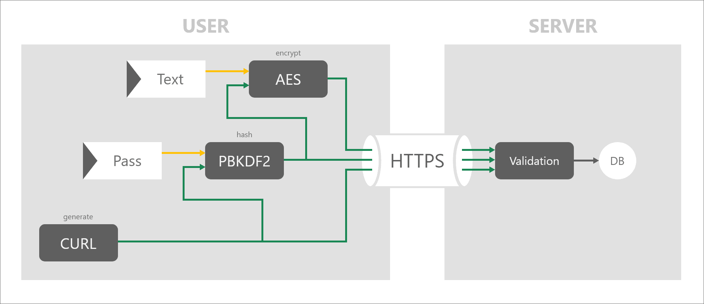

<h1 align="center">
   
  
   
   
  SCRT | RA8
   
</h1>

A newer version of <a href="https://github.com/alienars/share-secret" title="share-secret">( share-secret-v1 )</a>

React + TypeScript + Vite

Share your secret or text with a link <a href="https://scrt.ra8.ir" title="scrt.ra8.ir">( scrt.ra8.ir )</a>

## Features
- Your secret is encrypted with AES-256 algorithm by the password you choose 
- Your password is hashed by PBKDF2 + salt
- Completely Free Forever
- Self-Destructs (One Time View)
- End-To-End Encryption
- Without A Trace
- Zero-Knowledge Encryption

 

## How it works

## RA8

Developed and designed by <a href="https://ra8.ir" title="RA8.ir">RA8.ir</a>
